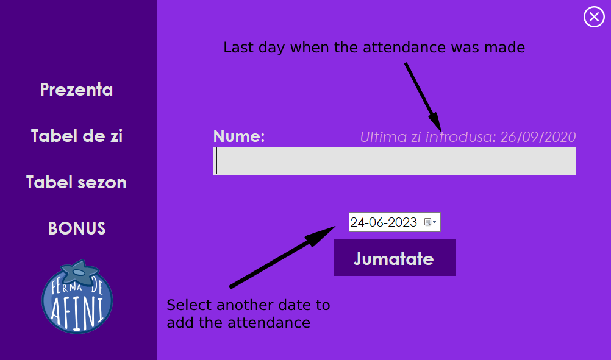
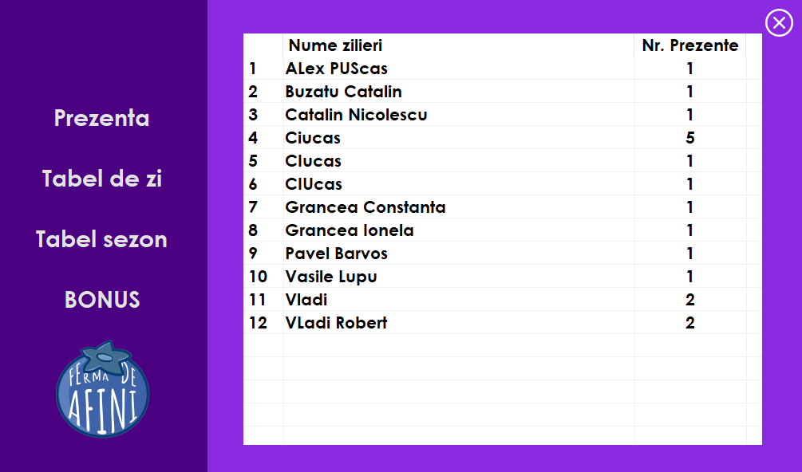
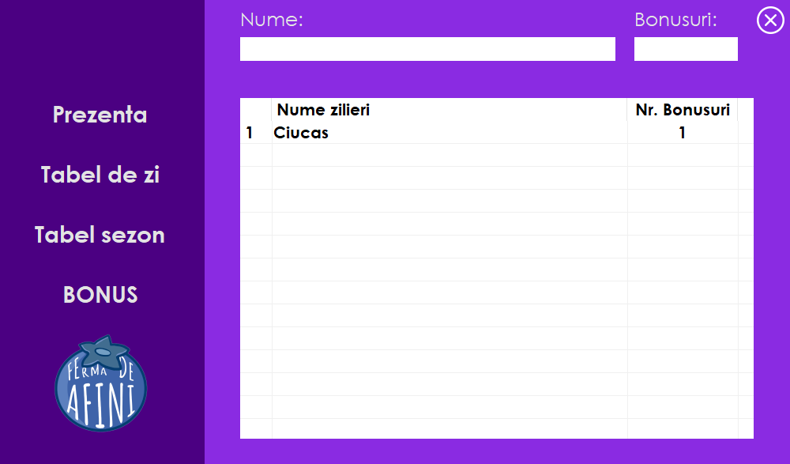

# VMB

This is my first attempt at creating a program, during my first year of college, self-learning. The purpose of the program is to manage the attendance of the daily workers on a blueberry farm throughout the entire harvesting season.

# Challenge

The majority of the workers would use different first names when they presented themselves, and I had to find a solution to track the attendance of the same individual without duplicating their records.

## Home

The Home page allows you to enter the name of the worker for the desired date. By default, the current date is pre-selected.

## Attendance Table

This page displays the attendance table, providing an overview of the attendance records for the ongoing harvesting season.

## Bonuses

Feature: You have the option to assign a bonus to workers based on the number of attendances. The table shows the workers eligible for at least one bonus and the number of bonuses they can receive. Simply enter their name and specify the number of bonuses you wish to assign at this moment.